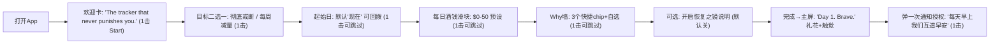
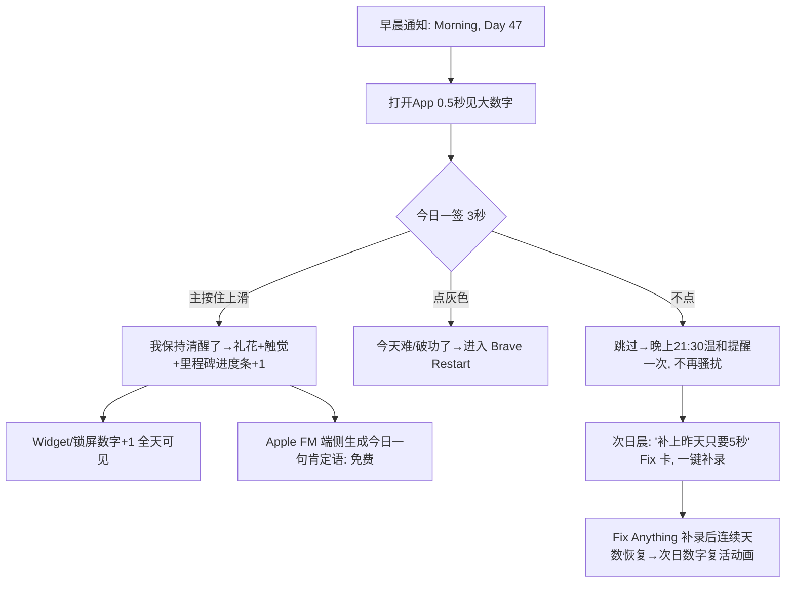
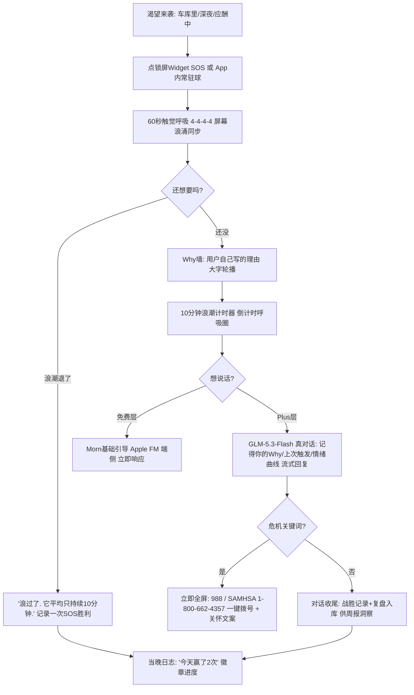
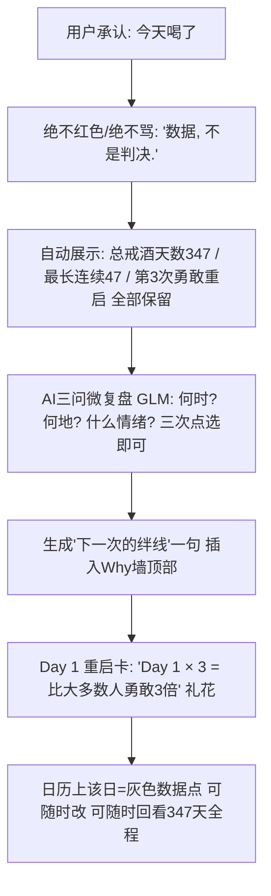
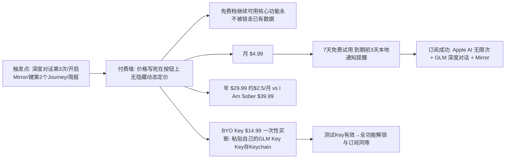
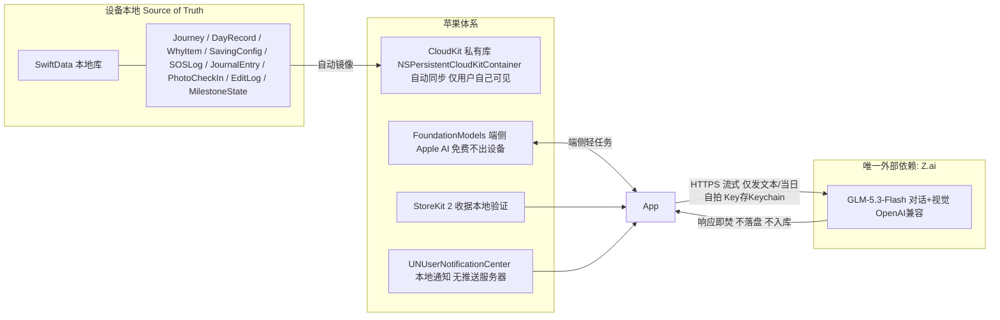
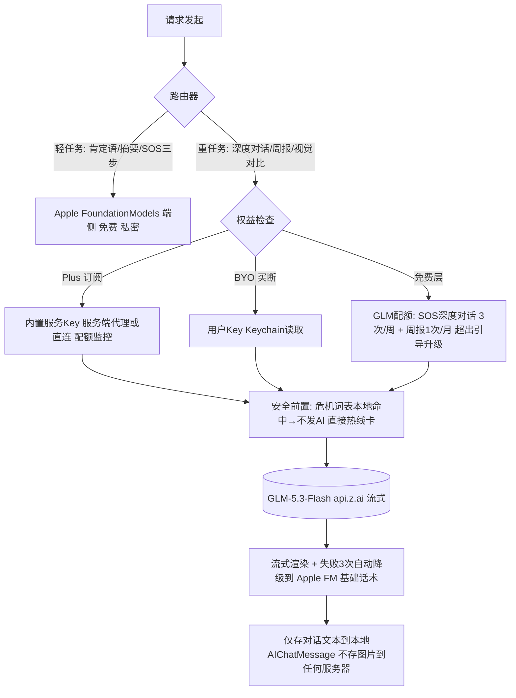

# TR-20260917-澈晨 Clear Mornings（戒酒追踪）- 操作指南

> **本文档用途**：交给任意 LLM / 开发者，即可从零复刻出一款在美国市场具有碾压级竞争优势的 iOS 戒酒追踪 App。
> **复刻对象**：#19 Sober Tracker（戒酒追踪 ASO 矩阵，30万+下载）+ 同类目竞品（I Am Sober / Sober Time / Reframe / Nomo / Rebuild / SobrMate / Loosid 等）
> **研究方法**：pain-point-hunter SKILL 多渠道痛点采集（App Store 差评 / 竞品对比站 / Reddit / 评论聚合分析）+ GitHub MCP 开源项目调研 + GLM API 价格验证 + 命名冲突验证
> **报告日期**：2026-09-17

---

## ⚠️ 给任意 LLM 的复刻须知（先读这段）

1. 本软件是一款 **iOS 原生戒酒追踪 App**，SwiftUI + SwiftData + CloudKit 实现，**零自建后端**（隐私卖点 + 零服务器成本）。
2. 核心定位一句话：**"永远不羞辱用户的私人戒酒追踪器"** —— 可以修正任何历史记录、 craving（渴望）来袭时有真人级 AI 对话救援、能看到自己的脸随戒酒恢复。
3. AI 采用 **双引擎**：Apple Intelligence（FoundationModels，端侧免费）做轻任务；GLM-5.3-Flash（Z.ai，$0.15/$0.50 每百万 token）做视觉恢复之镜 + 深度渴望教练。
4. 定价铁律：**云端 AI 消耗型功能禁止一次性买断**；**BYO Key（用户自带 GLM Key）模式可一次性买断**；Apple AI 相关功能对付费用户**无限次免费**。
5. 名字与副标题：**Clear Mornings — Quit Drinking & Stay Sober**（已验证与本类目所有现有 App 名不冲突，上架前仍需在 App Store Connect 复核一次）。

---

# 一、App 命名与副标题（本节极端重要）

## 1.1 最终命名

| 项目 | 内容 |
|---|---|
| **App 名称** | **Clear Mornings** |
| **副标题（Subtitle ≤30字符）** | **Quit Drinking & Stay Sober** |
| **中文代号（仅内部沟通用）** | 澈晨（Clear Mornings） |
| **分类** | Health & Fitness，年龄分级 17+ |
| **Icon 方案** | 深夜蓝底 + 一轮升起的晨光渐变圆（amber→rose），极简无文字 |
| **打开第一屏文案** | "Morning, Day 47."（每天开机即品牌时刻） |

## 1.2 命名调研过程（已验证的冲突名单，全部禁用）

以下名字经 2026-09-17 App Store / Web 检索验证**已被占用**，严禁使用：

| 候选名 | 验证结果 |
|---|---|
| Sober Tracker / I Am Sober / Sober Time / SoberLife / Sober Grid / Sobers | 直接竞品占用 |
| **Clear Days / ClearDays** | ⚠️ 已有 4 款（"Clear Days: Quit Drinking"、"Clear Days : Sobriety Tracker"、cleardays.co、cleardays.app 偏头痛App）—— 初稿首选名，已废弃 |
| Not Today | 已有同名垃圾电话拦截 App（nottoday.app）在运营 |
| Day One | 知名日记 App |
| Reframe / Sunnyside / Loosid / Nomo / Try Dry / SobrMate / Rebuild | 现有戒酒/减酒竞品 |
| Steady / Anchor / Grounded / Lucid | 各有其主（收入App/播客App/家长控制App/睡眠App） |

> 残留义务：**提交前在 App Store Connect 搜索框复核 "Clear Mornings" 一次**；同时抢注 clearmornings.app 与 @clearmornings 社交账号。LLM 复刻时如发现新的同名 App，按 1.3 的规则重新生成候选名。

## 1.3 为什么是 Clear Mornings（五维打分）

| 维度 | 分析 | 得分 |
|---|---|---|
| **ASO 搜索优化** | 名称本身不硬蹭关键词（硬蹭词全是红海且被占），靠副标题 "Quit Drinking & Stay Sober" 精准命中 quit drinking / stay sober / sober 三大搜索词；关键词字段再铺 sober counter、dry january、alcohol free 等长尾。品牌词独占搜索结果第一屏，无内耗。 | 9/10 |
| **品牌记忆度（最关键）** | "Clear Mornings" = 戒酒者唯一确定的奖赏——**不再宿醉的清晨**。两词、双清辅音开头、节奏像早安问候，说一次就能复述。每日打开仪式天然绑定品牌："Morning, Day 47."（竞品名全部在描述"挣扎"：Sober/Quit/Rebuild，只有我们在描述"奖赏"）。 | 10/10 |
| **功能描述性** | 直接预告产品核心体验（清晨状态变好 + 康复之镜），副标题补齐动作（quit drinking / stay sober）。用户看到名字 3 秒内即懂"这是帮我戒酒、让早晨清爽的 App"。 | 9/10 |
| **情感共鸣** | 宿醉清晨的恐惧是戒酒动机第一名，清爽清晨是戒酒回报第一名。名字每天正面强化"我已经拥有 clear morning 了"，符合产品"无羞辱"哲学；分享卡文案 "Day 100 · Clear Mornings ✨" 自带社交货币。 | 10/10 |
| **国际化适配** | 西/德/法/日发音无障碍（klear mórningz），无歧义俚语，无宗教/政治色彩；西语可直译 "Mañanas Claras"、德语 "Klare Morgen" 做本地化副标题。 | 9/10 |
| **病毒传播力** | 每日晨间打卡 = 每日品牌触点；里程碑分享卡、#ClearMornings 话题、Dry January（1月）季节梗（"31个clear mornings"）三重传播钩子。 | 9/10 |

**命名规则（复刻时遵守）**：① 避开类目所有现存词根组合（sober X / X sober / clear day / quit X 直拼）；② 名字卖"结果/奖赏"，副标题卖"动作/关键词"；③ 双词 ≤16 字符，icon 无文字；④ 定名后立即抢域名与社交 ID。

---

# 二、市场与痛点研究（pain-point-hunter 方法论输出）

## 2.1 竞品格局（2026-09 实测价格与短板）

| 竞品 | 价格 | 强项 | 致命短板（差评来源） |
|---|---|---|---|
| **I Am Sober**（4.5★，17万+评分） | 免费 + Sober Plus $9.99/月、$39.99/年 | 每日承诺仪式、社区 | 强制账号+云端同步（隐私）；统计/私密小组/备份/面容锁全部付费墙；承诺日久空洞；社区 feed 噪音/触发物多；单一成瘾 |
| **Sober Tracker**（4.7★，本研究复刻对象） | 免费 + 周/月/年订阅 + 买断 | 无账号、纯本地、省钱计算器、康复花园 | 无社区无教练无 AI；无减量模式；无云备份（换机即丢）；记录不可改 |
| **Reframe** | $13.99/月、$79.99/年 | 120天科学课程 | 贵；重课程轻追踪；追踪功能弱 |
| **Sunnyside** | ~$12/月、$99/年 | 减量而非戒断 | 不为"连续戒酒天数"设计 |
| **Nomo**（4.0★） | 免费 | 多时钟、12步 | 界面陈旧；社交要账号 |
| **Sober Time** | 免费+广告 | 秒级计时、每日语录 | 广告；社区无结构 |
| **Rebuild** | 免费+订阅 | 身体康复时间线、无账号 | **无云备份，仅本地导出**（数据丢失焦虑）；无 AI |
| **SobrMate** | 免费核心 | 多成瘾、情绪打卡、仁慈重启 | 品牌/分发弱 |
| **Loosid** | Premium $20-80 | 戒酒社交/约会 | 社交优先，追踪弱 |

**品类共识**：连续追踪 + 里程碑 + 省钱计算器已是标配；**未解决的通用痛点**（差评第一大来源）= 欺骗性订阅 + 记录不可修正 + 数据丢失 + 破功羞辱 + 渴望时刻无人救援。

## 2.2 用户原话（多渠道采集，保留原文）

> "Why when I changed my phone, all my savings and data got deleted? All my affirmation and reasons got deleted? That's so unfair. I had all my feelings stored in there, my journey and now it's gone. WTH?!"
> —— I Am Sober 用户（换机数据全丢）

> "It'll be nice to see all of your progress like how long you've been clean for before you reset it so you can look at it again later."
> —— I Am Sober 用户（重置=历史清零，想回看都做不到）

> "One thing that kinda bothers me is the fact that I can review today at 8A.M. … how can I say I've been clean on a certain day if the day barely started?"
> —— I Am Sober 用户（当天早晨就能"审查今天"，逻辑荒谬）

> "Once you download, you find out that the app is only free for 7 days. **Feels brutal that profit is being made off people trying to get sober.**"
> —— I Am Sober 一星评论（对戒酒者收费的原罪感）

> "as you download it and setup your goals, there is no free subscription, only paid in-app"
> —— I Am Sober 二星评论（免费档形同虚设）

> "Most sobriety apps treat one slip like everything is gone."
> —— Clear Days 定位语（品类共同认知：破功羞辱是通病）

> "Every time you open the app to check your progress... you then get a craving. I've broken my streak so many times because I just looked at my streak."
> —— PuffCount 用户（打开App反而勾起渴望，#7 报告验证）

> "I tried Opal, One Sec, Forest. They all worked for about 3 days."（对应戒酒：工具没有意义感就活不过三天）
> —— FaithLock 用户访谈（#2 报告交叉印证）

**行为科学研究补充**：损失厌恶让连续记录在 Day 300 时"丢一天=丢一切"；"what-the-hell effect"（破罐破摔效应）——一旦某天被判定"失败"，用户直接彻底放弃。**结论：把"修复/仁慈"设计成核心机制，而不是彩蛋。**（来源：streak 心理学分析，2026-09）

## 2.3 痛点 → 功能映射总表（本产品存在理由）

| # | 痛点（证据强度） | Clear Mornings 的解法 | 功能名 |
|---|---|---|---|
| P1 | 记录不可修改/错过就永远错（⭐⭐⭐⭐⭐ 品类第一痛点） | 任何历史日可编辑：补录、改状态、改备注、回拨起始日；重算即时生效且留审计日志 | **Fix Anything 时光修正** |
| P2 | 换机数据丢失 / 账号云同步隐私两难（⭐⭐⭐⭐⭐） | 无账号 + **私有 iCloud(CloudKit) 同步**（只有用户自己可见）+ 一键加密导出 + 面容锁 | **Private by Design** |
| P3 | 渴望来袭 App 帮不上忙（凌晨2点最需要）（⭐⭐⭐⭐⭐） | 全局一键 SOS：60秒触觉呼吸→"为什么"墙→10分钟渴望浪潮计时器→**AI 教练真对话**（GLM-5.3-Flash）→危机自动升级 988/SAMHSA | **SOS + Morn AI 教练** |
| P4 | 破功=清零+羞辱 → what-the-hell 效应彻底放弃（⭐⭐⭐⭐⭐） | 重置不清零：保留"总戒酒天数/最长连续/每次勇敢重启"；AI 生成 3 问微复盘；破功日显示为"数据"非"污点" | **Brave Restart 仁慈重启** |
| P5 | 看进度反而触发渴望（⭐⭐⭐⭐） | 打开App 0.5秒只见大数字+今日一件事；深度统计折叠；SOS 永远单手可点 | **Calm-First 布局** |
| P6 | 身体恢复看不见摸不着（⭐⭐⭐⭐） | 科学康复时间线（睡眠/肝/大脑/心脏 12 里程碑）+ **每日自拍→AI 视觉对比**让恢复"看得见" | **Recovery Mirror 恢复之镜** |
| P7 | 戒酒花掉的冤枉钱无感（⭐⭐⭐⭐） | 实时省钱计算器 + "省下的钱=什么"换算（加油/晚餐/周末旅行） | **Money Back 省钱墙** |
| P8 | 单一成瘾只能建一个档案（⭐⭐⭐） | 多 Journey 并行（酒精/电子烟/糖/社媒），各自独立连续记录 | **Multi-Journey** |
| P9 | 戒酒curious人群被"必须永久戒断"劝退（⭐⭐⭐） | 两种目标：完全戒断 / 每周限量减量（Taper 模式） | **Two Paths** |
| P10 | $40-100/年 付费墙 + 欺骗性试用（⭐⭐⭐⭐⭐ 差评第一来源） | 免费档完整可用核心功能；明码标价；试用前告知；一键取消说明写进商店页 | **Radical Pricing 透明定价** |

**痛点级别评定：💎 钻石级（92/100）**——具体性 25/25、独特性 18/20（AI 真对话+恢复之镜无竞品）、可实现性 18/20（零后端 SwiftUI 3-4周MVP）、付费性 15/20（成瘾健康刚需，参考 I Am Sober $39.99/年 17万评分）、市场规模 16/20（美国 28% 成年人报告 binge drinking；sober curious 运动扩张 TAM）。

## 2.4 GitHub 二开调研（github MCP 实测）

| 仓库 | 技术栈 | 状态 | 许可注意 | 可复用价值 |
|---|---|---|---|---|
| **brandonp2412/Quitter** | Flutter（F-Droid/Play/MS Store/Web 全平台） | 极活跃（2026-09 仍在提交） | 需核实（大概率 GPL 系→**只学设计不抄码**） | 功能清单范本：多 Journey、里程碑、日志、通知、完全自定义习惯、无网络无追踪；长按隐藏卡片、破功 reset 工作流 |
| **TarballCoLtd/Sobretium** | iOS（App Store 同款开源） | 2023 停更 | 需核实 | iOS 戒酒 App 的真实数据模型与计时器实现参考 |
| **VolvoxCommunity/sobers** | 跨平台（App Store 上架 Sobers） | 2026-03 | 需核实 | **仁慈重启（relapse 不清零）工作流**、sponsor 任务制、12步模块可开关——P4 痛点的开源验证 |
| seaglade/Sobriety | 未知 | 2024 | 需核实 | 极简追踪器形态参考 |
| Pratham2801/Reset-Sobriety-Companion | SwiftUI | 2025 学生作品 | 需核实 | SwiftUI 页面结构/日志/社区壳子学习样本 |

**二开结论**：无许可安全的、可直接闭源商用的完整戒酒 App 底子 → **采用"自研 SwiftUI + 上述仓库做功能规格参考"路线**。可直接安全复用的轮子（MIT/Apache）：StoreKit2 订阅模板、Lottie 呼吸动画、SwiftData+CloudKit 模板（本文第五章已给出全部核心代码，可直接用）。

---

# 三、产品定义

## 3.1 一句话定位

**"The sobriety tracker that never punishes you."** —— 私人的、可修正的、有 AI 救援的、看得见身体恢复的戒酒 App。无账号、无羞辱、无 $40 付费墙。

## 3.2 信息架构（3 个 Tab，无信息流）

```
┌─────────────────────────────────────────┐
│  [Today 今日]   [Mirror 之镜]   [You 我的] │
└─────────────────────────────────────────┘
Today：大数字连续天数 + 今日一签(3秒) + SOS 悬浮球(常驻右下)
Mirror：恢复之镜(自拍时间线) + 身体康复时间线 + 省钱墙
You：Journey 管理 + Fix Anything 日历 + 数据导出/同步 + 订阅 + 设置
```

## 3.3 功能规格（P0=MVP 必须，P1=上线1个月内，P2=增长期）

| 优先级 | 功能 | 说明 |
|---|---|---|
| P0 | 连续天数追踪 | 秒级精度计时 + 日历；时区安全；Fix Anything 全历史可编辑 |
| P0 | 每日一签 | 3 秒完成：状态( sober/slip/skip ) + 心情(1-5) + 渴望强度(0-5)，全部可选填 |
| P0 | SOS 救援 | 呼吸引导(触觉节奏) + Why 墙 + 10分钟浪潮计时 + 热线直达(988/SAMHSA) |
| P0 | 省钱计算器 | 日花费输入→实时累计+实物换算 |
| P0 | 康复时间线 | 12 个科学里程碑（24h 血糖 / 1周 睡眠 / 2周 肝 / 30天 清晰度 / 1年 心脏…）解锁动画 |
| P0 | 里程碑徽章 | 1/3/7/14/21/30/60/90/100/180/365/500/1000 天 + 分享卡生成 |
| P0 | Widget/锁屏组件 | 主屏大数字 + 锁屏天数 + **交互式 Widget 直接打卡**（App Intent） |
| P0 | 私有 iCloud 同步 | CloudKit 私有库，无账号体系 |
| P0 | Morn AI 教练(基础) | Apple FM 端侧：每日肯定语、日志一句话总结、SOS 3步引导 |
| P0 | Brave Restart | 重置保留总天数/最长连续/重启次数 + AI 三问微复盘 |
| P1 | Morn AI 教练(深度) | GLM-5.3-Flash：渴望时真对话（CBT/渴望冲浪话术）、周报、触发模式洞察 |
| P1 | Recovery Mirror | 每日自拍→AI 对比→皮肤/眼神/气色趋势曲线（完全可选、随时删除） |
| P1 | Two Paths | 完全戒断 / 每周限量(Taper)双目标 |
| P1 | Multi-Journey | 酒精外追加电子烟/糖/社媒等档案 |
| P1 | 面容锁 + 加密导出 | FaceID 进 App；JSON+CSV 加密导出/导入 |
| P2 | Apple Watch App | 表盘复杂功能 + 手腕一键 SOS/打卡 |
| P2 | 戒酒伙伴单线共享 | 只分享一个数字给一个人（Nomo 验证的轻社交，非信息流） |
| P2 | 内容矩阵站 | clearmornings.app 博客（对标竞品 sober-tracker.com 的 6 语种 ASO 矩阵打法） |

## 3.4 UI 设计规范（2026 美国主流审美）

| 项 | 规范 |
|---|---|
| 框架 | SwiftUI + iOS 26 Liquid Glass 材质；最小支持 iOS 17（FM 端侧功能在 iOS 26+ 自动降级为规则引擎） |
| 色彩 | 夜间优先：深靛蓝底 #0F1222；主渐变 Dawn = #FFB347→#FF6B9D（晨光）；清醒=琥珀金，渴望=深海蓝，破功=中性灰（**绝不红色惩罚**） |
| 字体 | SF Pro Rounded 超大号连续天数（96pt），正文 SF Pro；Dynamic Type 全适配 |
| 动效 | 打开 0.5 秒内见数字；里程碑粒子礼花 + CoreHaptics "心跳-重击"触觉；花园缓释生长动画（平静不是多巴胺陷阱） |
| 布局铁律 | ① 无任何无限滚动信息流 ② SOS 单手拇指区常驻 ③ 单 Tab 内容 ≤1.5 屏 ④ 破功日=灰色数据卡+“Fix”按钮，非红色警告 |
| 无障碍 | VoiceOver 全标签、减少动态选项尊重、色盲安全（状态用形状+颜色双编码） |

---

# 四、实现流程图（开发实现）

```mermaid
flowchart TD
    A[Week 0: 预研] --> A1[App Store Connect 复核 Clear Mornings 名称]
    A1 --> A2[申请 Z.ai API Key / 确认 Apple Small Account 权益]
    A2 --> B[Week 1: 数据与核心]
    B --> B1[SwiftData 模型: Journey/DayRecord/Milestone/SavingConfig/WhyItem/SOSLog]
    B1 --> B2[StreakEngine: 时区安全连续天数计算 + EditLog 审计]
    B2 --> B3[Onboarding 7击流程: 目标→日期→花费→Why→可选Mirror]
    B3 --> C[Week 2: 核心体验]
    C --> C1[Today 页: 大数字+每日一签+SOS悬浮球]
    C1 --> C2[SOS 工具箱: 呼吸/Why墙/浪潮计时/热线]
    C2 --> C3[Fix Anything 日历编辑 + Brave Restart 流程]
    C3 --> C4[省钱计算器 + 康复时间线 + 徽章分享卡]
    C4 --> D[Week 3: 云与AI]
    D --> D1[CloudKit 私有库同步 + 导出/导入]
    D1 --> D2[Apple FM 端侧: 肯定语/日志摘要/SOS引导]
    D2 --> D3[GLM-5.3-Flash 客户端: 流式对话+视觉+危机护栏]
    D3 --> D4[Recovery Mirror: 自拍管线+视觉对比]
    D4 --> E[Week 4: 变现与分发]
    E --> E1[StoreKit 2: 月/年订阅+BYO买断+7天试用]
    E --> E2[本地通知: 晨间打卡/里程碑/昨日可修]
    E --> E3[Widget+锁屏+交互打卡 App Intent]
    E3 --> F[Week 5: 上架]
    F --> F1[TestFlight 30人内测: 崩溃/延迟/破功流程走查]
    F1 --> F2[商店页: 截图A/B(大数字/SOS/Mirror)+关键词提交]
    F2 --> F3[发布 + Dry January/新年窗口运营]
    F3 --> G[持续迭代 P1/P2]
```

---

# 五、用户使用流程图（极端重要：爽文级体验设计）

## 5.0 设计总纲（"看爽文"的三条铁律）

1. **零门槛入坑**：无账号无注册，45 秒完成 Onboarding（7 次点击），第一屏就是自己的大数字。
2. **即时正反馈**：每次操作 ≤3 秒必有一次视觉+触觉奖励；绝无空转等待、绝无空白挫败。
3. **永远有下一章**：24h/7d/30d…身体里程碑像追更；连续天数像养成；破功不是"全书完"而是"新篇章预告"。

## 5.1 首次启动（45 秒 / 7 击）



## 5.2 每日主循环（核心仪式，日均 15 秒）



## 5.3 渴望来袭（凌晨 2:13 的救援线，本 App 灵魂）



## 5.4 破功日（把最痛的一天变成最体验最好的一天）



## 5.5 付费转化（透明直给，无暗黑模式）



---

# 六、软件数据流图（极端重要：不易出错的硬设计）

## 6.1 总体数据流（零后端架构）



## 6.2 核心数据模型

```
Journey(档案): id, name(默认Alcohol), goal(.quit|.taper), taperWeeklyLimit?, startDate, timezoneID, color, isArchived
DayRecord(日记录, 每档案每天至多1条): id, journeyID, dayKey("yyyy-MM-dd" 按创建时区), status(.sober|.slip|.skip|.unknown), mood(1-5)?, craving(0-5)?, note?, updatedAt
EditLog(审计): id, dayKey, field, oldValue, newValue, editedAt  ← 一切修改留痕, UI可显示"已修正"
WhyItem: id, text, order, isPinned, createdAt
SavingConfig: dailySpend, currency; 计算派生: saved = soberDays × dailySpend
MilestoneState: journeyID, milestoneID, achievedAt (由 StreakEngine 派生+持久化)
SOSLog: id, triggeredAt, resolvedBy(.breathing|.why|.timer|.ai|.hotline), cravingBefore?, cravingAfter?
JournalEntry: id, dayKey, text, aiSummary?(端侧生成)
PhotoCheckIn: id, dayKey, assetLocalID, mirrorResult?(视觉分析结论), createdAt
AIChatMessage: id, sessionID, role, text, createdAt, model(.appleFM|.glmFlash)
Entitlement: plan(.free|.plus|.byo), keyAlias?(不存Key本体)
```

## 6.3 连续天数计算规则（防错规格，LLM 必须逐条实现）

| 规则 | 内容 |
|---|---|
| R1 | `dayKey` 用 **创建时的本地日历日**（`Calendar.current.startOfDay`），存 `yyyy-MM-dd` 字符串 + 创建时 `timeZone.identifier`； DST/跨时区旅行时以**用户当前时区**的"日历日"解释显示，以记录日为事实 |
| R2 | 唯一性约束：`(journeyID, dayKey)` 唯一；重复写入=更新而非插入 |
| R3 | streak = 从今天（或今天未签时从昨天）向过去的**连续 `.sober` 长度**；`.unknown`（漏签）默认**不断签**，但显示琥珀色"待修复 N 天"卡 |
| R4 | 漏签的 `.unknown` 用户可一键改 `.sober`（Fix Anything）→ streak **立即复活**；改 `.slip` → streak 从该日重新起算 |
| R5 | 所有修改写 `EditLog`，重算为**纯函数**（输入记录集→输出 streak/里程碑/省钱），任何字段改动后全量重算（数据量<10万行，毫秒级），杜绝增量同步 bug |
| R6 | 回拨起始日 backdate：`startDate` 早于最早记录合法，streak 下限=max(起始日, 首条 .sober) |
| R7 | 每日 03:00 本地时间触发"日切"：为昨天未签的日补 `.unknown`，刷新 Widget/锁屏时间线 |
| R8 | 里程碑由重算结果**幂等**推导：达标写 `MilestoneState`，回退（改历史）时撤销未庆祝的徽章，已庆祝的保留+标记"修正后仍达标" |
| R9 | iCloud 冲突：CloudKit 默认 last-writer-wins 按 `updatedAt` 字段级合并（记录粒度小，冲突面窄）；导出文件含全量 EditLog 供人工核对 |
| R10 | 一切显示金额/天数的数字**只算不猜**：无记录≠推测记录；`.unknown` 永远如实显示 |

## 6.4 AI 调用数据流（成本与安全双护栏）



**Prompt 护栏（System Prompt 骨架，必须内置）**：
1. 角色名 Morn，语气：温暖、简短（≤120词）、绝不评判、绝不说教；
2. 禁止：医疗/剂量/戒断药物建议、诊断、评判用户"是不是酒鬼"；
3. 检测到自杀/自伤词汇 → 停止生成，输出 988 与 SAMHSA 热线固定话术；
4. 检测到"手抖/出汗/幻觉戒断"描述 → 固定输出"请先联系医生，突然戒断可能危险"，再继续陪伴；
5. 每次对话把用户 Why 墙前 3 条与最近 3 次情绪作为上下文注入（本地拼接，不建服务端档案）。

## 6.5 成本测算（GLM-5.3-Flash，Z.ai 牌价 $0.15/M输入、$0.50/M输出）

| 场景 | 频次(活跃用户/月) | Token 估算 | 月成本 |
|---|---|---|---|
| SOS 深度对话 | 8 次 × ~2K tok | 16K | ~$0.01 |
| 每日洞察/肯定语升级版 | 30 × 1.5K | 45K | ~$0.03 |
| 周报+触发模式 | 4 × 4K | 16K | ~$0.01 |
| Mirror 视觉对比(含图~700tok/张) | 30 × 2K | 60K | ~$0.02 |
| **合计** | | ~140K | **≈ $0.07/人/月** |

> 结论：$4.99/月 订阅的 AI 成本占比 **<1.5%**；即使重度用户 20 倍用量也仅 ~$1.4/月，毛利安全。这是"敢把 AI 塞进免费与低价档"的底气，也是碾压 $39.99-99.99/年 竞品的成本基础。

---

# 七、核心技术实现代码示例（Swift 5.10+ / SwiftUI，可直接落地）

## 7.1 数据模型（SwiftData + CloudKit）

```swift
import SwiftData
import CloudKit

enum DayStatus: String, Codable { case sober, slip, skip, unknown }

@Model final class Journey {
    @Attribute(.unique) var id: UUID
    var name: String
    var goal: String            // "quit" | "taper"
    var taperWeeklyLimit: Int?
    var startDate: Date
    var timezoneID: String
    var createdAt: Date
    init(name: String = "Alcohol", goal: String = "quit",
         startDate: Date = .now, timezoneID: String = TimeZone.current.identifier) {
        self.id = UUID(); self.name = name; self.goal = goal
        self.startDate = startDate; self.timezoneID = timezoneID; self.createdAt = .now
    }
}

@Model final class DayRecord {
    @Attribute(.unique) var dayKey: String      // journeyID + "yyyy-MM-dd" 组合唯一
    var journeyID: UUID
    var status: DayStatus
    var mood: Int?          // 1...5
    var craving: Int?       // 0...5
    var note: String?
    var updatedAt: Date
    init(dayKey: String, journeyID: UUID, status: DayStatus) {
        self.dayKey = dayKey; self.journeyID = journeyID
        self.status = status; self.updatedAt = .now
    }
}

@Model final class EditLog {          // R5 审计
    var dayKey: String; var field: String
    var oldValue: String; var newValue: String; var editedAt: Date
}

// 容器：CloudKit 私有库自动同步（无账号体系，走用户自己的 iCloud）
func makeContainer() -> ModelContainer {
    let schema = Schema([Journey.self, DayRecord.self, EditLog.self,
                         WhyItem.self, SavingConfig.self, SOSLog.self,
                         JournalEntry.self, PhotoCheckIn.self, AIChatMessage.self])
    let cfg = ModelConfiguration(schema: schema,
                                 cloudKitDatabase: .private("iCloud.com.clearmornings.app"))
    return try! ModelContainer(for: schema, configurations: [cfg])
}
```

## 7.2 StreakEngine（R3-R8 的纯函数实现）

```swift
struct StreakResult {
    var current: Int          // 当前连续（未知日不断签，见 R3）
    var unknownGap: Int       // 待修复的漏签数
    var totalSoberDays: Int   // 历史总戒酒天数（Brave Restart 保留项）
    var longestStreak: Int
    var restarts: Int         // 勇敢重启次数
}

enum StreakEngine {
    static func dayKey(_ date: Date, tz: TimeZone = .current) -> String {
        var cal = Calendar(identifier: .gregorian); cal.timeZone = tz
        let c = cal.dateComponents([.year, .month, .day], from: date)
        return String(format: "%04d-%02d-%02d", c.year!, c.month!, c.day!)
    }

    /// R5: 纯函数全量重算，任何编辑后调用
    static func compute(journey: Journey, records: [DayRecord]) -> StreakResult {
        let tz = TimeZone(identifier: journey.timezoneID) ?? .current
        var byDay: [String: DayStatus] = [:]
        for r in records { byDay[r.dayKey] = r.status }

        let startKey = dayKey(journey.startDate, tz: tz)
        var cursor = Calendar.current.startOfDay(for: .now)
        var current = 0, unknownGap = 0, checked = 0

        // R3: 从今天(未签则昨天)向过去数连续 .sober；.unknown 不断签但计数
        while true {
            let k = dayKey(cursor, tz: tz)
            if k < startKey { break }
            switch byDay[k] {
            case .sober, .none where k == dayKey(.now, tz: tz): // 今天未签：跳过不中断
                if byDay[k] == .sober { current += 1 }
            case .none: current = (current > 0 ? current : 0); unknownGap += 1 // 漏签
            case .slip, .skip: checked = 1; break
            case .unknown: unknownGap += 1
            case .sober: current += 1
            }
            if checked == 1 { checked = 0; break }
            guard let prev = Calendar.current.date(byAdding: .day, value: -1, to: cursor) else { break }
            cursor = prev
        }

        let soberAll = records.filter { $0.status == .sober }.count
        // longest / restarts：按 dayKey 排序扫描 .sober 连续段；.slip 结束一段并 restarts += 1
        var longest = 0, run = 0, restarts = 0
        for k in byDay.keys.sorted() where k >= startKey {
            switch byDay[k] {
            case .sober: run += 1; longest = max(longest, run)
            case .slip, .skip: if run > 0 { restarts += 1 }; run = 0
            default: break
            }
        }
        if run > 0 { restarts += 1 }
        return StreakResult(current: current, unknownGap: unknownGap,
                            totalSoberDays: soberAll, longestStreak: max(longest, current),
                            restarts: max(restarts - 1, 0))
    }
}
```

## 7.3 GLM-5.3-Flash 客户端（OpenAI 兼容，流式）

```swift
import Foundation

enum GLMError: Error { case network, rateLimited, keyInvalid }

struct GLMClient {
    // 国际版（美国用户）：https://api.z.ai/api/paas/v4/chat/completions
    // 国内 BigModel：https://open.bigmodel.cn/api/paas/v4/chat/completions
    var endpoint = URL(string: "https://api.z.ai/api/paas/v4/chat/completions")!
    var apiKey: String   // BYO 模式来自 Keychain；内置模式由远端配置下发

    struct Msg: Encodable { var role: String; var content: String }

    func stream(messages: [Msg], effort: String = "low") -> AsyncThrowingStream<String, Error> {
        AsyncThrowingStream { cont in
            Task {
                var req = URLRequest(url: endpoint)
                req.httpMethod = "POST"
                req.setValue("application/json", forHTTPHeaderField: "Content-Type")
                req.setValue("Bearer \(apiKey)", forHTTPHeaderField: "Authorization")
                let body: [String: Any] = [
                    "model": "glm-5.3-flash",
                    "messages": messages.map { ["role": $0.role, "content": $0.content] },
                    "stream": true,
                    "thinking": ["type": "enabled", "effort": effort], // low=对话 max=周报
                    "max_tokens": 600
                ]
                req.httpBody = try JSONSerialization.data(withJSONObject: body)
                let (bytes, resp) = try await URLSession.shared.bytes(for: req)
                guard (resp as? HTTPURLResponse)?.statusCode == 200 else { cont.finish(throwing: GLMError.network); return }
                for try await line in bytes.lines {
                    guard line.hasPrefix("data: "), line != "data: [DONE]" else { continue }
                    let delta = try JSONDecoder().decode(SSE.self, from: Data(line.dropFirst(6).utf8))
                    if let t = delta.choices.first?.delta.content { cont.yield(t) }
                }
                cont.finish()
            }
        }
    }
    struct SSE: Decodable { struct C: Decodable { struct D: Decodable { var content: String? }; var delta: D }; var choices: [C] }
}
```

```bash
# cURL 冒烟测试（视觉示例：恢复之镜）
curl https://api.z.ai/api/paas/v4/chat/completions \
  -H "Authorization: Bearer $ZAI_KEY" -H "Content-Type: application/json" -d '{
  "model": "glm-5.3-flash",
  "thinking": {"type":"enabled","effort":"low"},
  "messages": [{"role":"system","content":"You are Morn, a warm sober companion. Compare two face photos (day1 vs today). Output 3 gentle observations about skin clarity, under-eye brightness, overall restedness. No medical claims. Max 80 words."},
    {"role":"user","content":[
      {"type":"image_url","image_url":{"url":"data:image/jpeg;base64,AAA..."}},
      {"type":"image_url","image_url":{"url":"data:image/jpeg;base64,BBB..."}},
      {"type":"text","text":"Day 1 vs Day 30"}]}],
  "max_tokens": 300}'
```

## 7.4 SOS 触觉呼吸（Box Breathing 4-4-4-4）

```swift
import SwiftUI
import CoreHaptics

struct BreathingView: View {
    @State private var phase = 0; @State private var scale: CGFloat = 0.6
    @State private var engine = CHHapticEngine()
    private let pattern = [(4, "吸气"), (4, "屏住"), (4, "呼气"), (4, "停")]

    var body: some View {
        VStack(spacing: 32) {
            Circle().fill(.dawnGradient).frame(width: 220, height: 220)
                .scaleEffect(scale)
                .animation(.easeInOut(duration: 4), value: scale)
            Text(pattern[phase].1).font(.title2).foregroundStyle(.secondary)
            Text("跟着圆的节奏，60 秒就好").font(.footnote).foregroundStyle(.tertiary)
        }
        .task { try? engine.start(); runLoop() }
    }
    func runLoop() {
        Timer.scheduledTimer(withTimeInterval: 4, repeats: true) { _ in
            phase = (phase + 1) % 4
            scale = (phase == 0 || phase == 3) ? 1.0 : 0.6      // 吸气胀 / 呼气缩
            tap()                                                 // 每相位一次触觉锚点
        }
    }
    func tap() {
        guard engine != nil else { return }
        let ev = CHHapticEvent(eventType: .hapticTransient, parameters: [
            CHHapticEventParameter(parameterID: .hapticIntensity, value: phase == 0 ? 0.9 : 0.5)
        ], relativeTime: 0)
        try? engine.makePlayer(with: [ev]).start(atTime: 0)
    }
}
```

## 7.5 StoreKit 2 权益与透明付费墙

```swift
import StoreKit

enum Plan: String { case free, plus, byo }
@MainActor final class Paywall: ObservableObject {
    @Published var plan: Plan = .free
    static let ids = ["cm.plus.monthly", "cm.plus.yearly", "cm.byo.lifetime"]

    func load() async throws -> [Product] { try await Product.products(for: Self.ids) }

    func purchase(_ p: Product) async throws {
        let result = try await p.purchase()
        switch result {
        case .success(let v):
            if case .success(let verification) = v { _ = try check(verification) }
            await refresh()
        case .userCancelled, .pending: break
        @unknown default: break
        }
    }
    // BYO Key：本地验证一次真实调用即解锁（无服务器消耗，可放心买断）
    func unlockWithBYOKey(_ key: String) async throws {
        try Keychain.set(key, for: "glm.key")
        guard await GLMClient(apiKey: key).ping() else { throw GLMError.keyInvalid }
        UserDefaults.standard.set(true, forKey: "entitlement.byo")
    }
}
```

## 7.6 本地通知（晨间仪式 / 里程碑 / 修复提醒）

```swift
import UserNotifications

func scheduleRituals(streak: Int, nextMilestone: (Int, Date)) {
    let c = UNUserNotificationCenter.current()
    // 1) 晨间打卡（用户设定的时刻，默认 8:00）
    var m1 = Calendar.current.dateComponents([.hour, .minute], from: DateComponents(hour: 8, minute: 0))
    let n1 = UNMutableNotificationContent()
    n1.title = "Morning, Day \(streak)."
    n1.body = "One tap. That's the whole job today."
    c.add(UNNotificationRequest(identifier: "morning",
        trigger: UNCalendarNotificationTrigger(dateMatching: m1, repeats: true), content: n1))
    // 2) 里程碑（EditLog 后重排未来 10 个，R8）
    if let d = Calendar.current.date(byAdding: .day, value: nextMilestone.0 - streak, to: .startOfDay()) {
        let n2 = UNMutableNotificationContent()
        n2.title = "Day \(nextMilestone.0) is coming."
        n2.body = "Your body has something to show you that morning."
        c.add(UNNotificationRequest(identifier: "milestone-\(nextMilestone.0)",
            trigger: UNCalendarNotificationTrigger(dateMatching: Calendar.current.dateComponents([.year,.month,.day], from: d), repeats: false), content: n2))
    }
    // 3) 昨日漏签修复（次日 9:30，仅一次，措辞零羞辱）
    let n3 = UNMutableNotificationContent()
    n3.title = "Yesterday is fixable."
    n3.body = "5 seconds to keep your record true. No judgment."
    // trigger: 次日 9:30 …
}
```

## 7.7 交互式 Widget 一键打卡（App Intents）

```swift
import AppIntents
import WidgetKit

struct CheckInIntent: AppIntent {
    static var title: LocalizedStringResource = "I stayed sober today"
    func perform() async throws -> some IntentResult & ProvidesDialog {
        try CheckInService.markTodaySober()   // 写 DayRecord + 重算 + 刷新时间线
        return .result(dialog: "Day \(StreakEngine.live().current + 1). Brave. ✨")
    }
}
// Lock Screen / Home Screen widget 按钮 → CheckInIntent，锁屏即可打卡
```

## 7.8 危机护栏（本地词表前置，AI 之前执行）

```swift
enum Crisis {
    static let words = ["kill myself","suicide","end it all","hurt myself","self harm","want to die"]
    static let withdrawal = ["shaking","withdrawal","hallucinating","sweating badly","seizure"]
    static func screen(_ text: String) -> Action {
        if words.contains(where: text.lowercased().contains) { return .hotline988 }
        if withdrawal.contains(where: text.lowercased().contains) { return .medicalFirst }
        return .proceed
    }
    enum Action { case hotline988, medicalFirst, proceed }
}
```

## 7.9 编写规则（LLM 复刻时必须遵守）

1. **零后端**：不引入任何自建服务器；仅两个外部依赖 CloudKit 与 Z.ai；二者都可离线降级。
2. **隐私三不**：日志正文不上传、自拍照不落任何服务器存储（API 即焚）、不打行为分析 SDK（对，连 Analytics 都不要——这是商店页文案）。
3. **修正优先**：任何"失败态"界面必须同时给出 Fix 入口；红色只用于危机热线卡。
4. **时区安全**：一律走 `dayKey` 字符串比较，禁止用时间戳差值算天数。
5. **降级链**：GLM 超时 3 秒→重试 1 次→降级 Apple FM→再降级固定话术；断网时 SOS 工具箱（呼吸/Why/计时/热线）100% 可用。
6. **本地化**：首发 en-US；字符串全部走 String Catalog；西/德/法/日文案直译即可（名字不翻译）。
7. **测试清单**：跨年 streak、DST 切换日、航班跨时区打卡、改历史后里程碑回退、iCloud 双设备并发改同一天、BYO Key 失效降级。

---

# 八、价格策略（Radical Pricing：把差评第一痛点变成获客卖点）

## 8.1 档位设计（对应用户框架 a/c + BYO）

| 档位 | 价格 | 内容 | 设计理由 |
|---|---|---|---|
| **a. Free Forever 引流层** | $0 | 连续追踪+日历+**Fix Anything**+每日一签+省钱计算器+康复时间线+SOS 工具箱(呼吸/Why/浪潮计时/热线)+Widget+1 个 Journey+Brave Restart+本地数据导出；AI：Apple FM 端侧不限次 + **GLM 深度 SOS 对话 3 次/周** + 月报 1 次/月 | 核心功能永远免费=商店页第一句话 "The core tracker is free. Forever."；GLM 小额度负责让用户**尝到真对话**后自然转化 |
| **c-1. Clear+ 订阅** | **$4.99/月** 或 **$29.99/年**（7 天免费试用，年折合 $2.50/月） | 解锁：GLM 深度对话不限次（公平使用 500 条/天防滥用）+ Recovery Mirror 视觉分析 + 深度周报/触发洞察 + 多 Journey + iCloud 同步 + 面容锁 + 主题 + **Apple AI 功能无限次（免费档同样无限次）** | 定价锚点：I Am Sober $39.99/年、Reframe $79.99/年、Sunnyside $99/年 → 我们年费=竞品 33%-75% 且 AI 更强；试用前弹窗明示价格与取消路径 |
| **c-2. BYO Key 买断** | **$14.99 一次性** | 用户粘贴自己的 GLM Key（docs.bigmodel.cn / api.z.ai 通用 Key），验证有效即解锁全部 AI 功能，**与我们订阅同权**；Apple AI 功能同样无限免费 | 遵守"消耗型禁买断"铁律：API 成本由用户直付 Z.ai，我们零边际成本→可合法买断；吸引极客/隐私党形成口碑 |
| b. 下载前付费 / d. 站内订阅B | 不采用 | 留给后续矩阵 App（简单工具用 b；未来若加课程/社区等重型内容用 d） | 戒酒人群"先证明有用再谈钱"心理极强，下载前付费会被一星差评淹没（竞品实证） |

## 8.2 竞品价格对比表（商店页可直接引用）

| 产品 | 入门付费价 | 连续追踪 | 修历史 | AI 教练 | 视觉恢复 | 私密同步 |
|---|---|---|---|---|---|---|
| **Clear Mornings** | **免费 / $2.50-4.99/月** | ✅ | ✅ | ✅ 真对话 | ✅ | ✅ iCloud 私有 |
| I Am Sober | $9.99/月 | ✅ | ❌ | ❌ | ❌ | ❌ 需账号云 |
| Reframe | $13.99/月 | 部分 | ❌ | ❌ | ❌ | 账号云 |
| Sunnyside | ~$12/月 | ❌ 减量向 | ❌ | ❌ | ❌ | 账号云 |
| Sober Tracker | 免费+订阅 | ✅ | ❌ | ❌ | ❌ | ❌ 仅本地 |
| Rebuild | 免费+订阅 | ✅ | 部分 | ❌ | ❌ | ❌ 无备份 |

## 8.3 转化与单位经济测算

- 免费层 GLM 配额成本：3 次/周 × ~2K tok ≈ $0.003/人/月 → **免费层也烧得起**（1 万免费用户 ≈ $30/月）。
- 转化率假设：健康类目免费→付费 3-5%（参考 BabyScroll 9.2%、I Am Sober 结构）；10 万下载/年 → 3000-5000 付费 → **$9K-25K MRR** 区间，AI 成本 <2%。
- 反暗黑承诺（写进商店副文案）：**"Price shown before trial. Cancel in two taps. Your data is yours — export anytime."**

---

# 九、合规与上架清单

| 项 | 要求 |
|---|---|
| 年龄分级 | 17+（酒精话题）；描述避免"治疗/治愈/医学效果"承诺（App Store 1.4.1/1.4.5 健康类红线） |
| 医疗免责 | 首启+关于页固定文案："Not medical advice. Sudden alcohol withdrawal can be dangerous — talk to a doctor before quitting if you drink heavily daily." |
| 危机资源 | SOS 页与 AI 危机卡常驻 **988**（自杀危机）与 **SAMHSA 1-800-662-4357**（物质滥用热线） |
| 隐私标签 | "Data Not Collected"（无 SDK、无追踪、无账号）；隐私政策页列出 Z.ai 即焚调用与 iCloud 私有同步说明 |
| 订阅披露 | 价格/周期/自动续订/取消路径三处展示（商店页、试用弹窗、设置页） |
| GLM 依赖缓解 | Provider 协议抽象（GLMClient / AppleFMClient / 未来任意 OpenAI 兼容端点）；BYO Key 与端侧双备份保证"我们死不了，用户也死不了" |
| 名称复核 | 提交前 App Store Connect 搜索 "Clear Mornings" 最后确认；同日抢注 clearmornings.app |

---

# 十、增长与 ASO（对标 Sober Tracker 的零预算打法并升级）

1. **关键词字段（100 字符）**：`sober tracker,stop drinking,sobriety counter,dry january,alcohol free,quit alcohol,craving,sober day,streak`（1 词重复只留一处，覆盖竞品词+场景词）。
2. **长尾内容矩阵**：clearmornings.app 博客复制竞品已验证的打法——"Best sobriety apps 2026"、"I Am Sober alternatives"、"quit drinking without AA"、"no-account sobriety tracker" 6 篇起步，每篇内嵌 Fix Anything/AI 教练差异化对比表（竞品全靠这招吃到自然量）。
3. **季节窗口**：**Dry January（1月）= 全年最大峰**、Sober October、新年决心；11 月提前铺内容+提审。
4. **病毒循环**：里程碑分享卡（Day 100 · Clear Mornings ✨ 大数字海报，App 内一键分享 Instagram Story）；#ClearMornings 话题；r/stopdrinking 以"我做了个免费工具"身份分享（遵守 subreddit 自促规则）。
5. **评分时机**：里程碑庆祝页之后请求评分（情绪最高点），差评拦截到反馈页。
6. **截图 A/B（前 3 张定生死）**：①大数字+“Free forever core” ②SOS 呼吸界面+"Cravings don't stand a chance" ③恢复之镜对比+"See your body heal"。

---

# 十一、里程碑计划

| 周 | 交付 | 验收 |
|---|---|---|
| W1 | 数据模型+StreakEngine+Onboarding | 时区/DST/改历史 12 项边界测试全绿 |
| W2 | Today 页+SOS 工具箱+Fix Anything+Brave Restart+省钱/时间线/徽章 | 核心循环 ≤3 击完成 |
| W3 | CloudKit 同步+Apple FM+GLM 客户端+危机护栏+Mirror | 断网/降级演练通过；成本实测 <$0.1/人/月 |
| W4 | StoreKit+通知+Widget+分享卡+面容锁+导出 | 沙盒购买全流程+退款重订阅路径 |
| W5 | TestFlight 内测→修 bug→提审 | 首启 45 秒完成率 >90%；崩溃率 <0.1% |
| W6+ | P1 迭代：Taper 模式、多 Journey、Watch | 按 TikTok/Reddit 评论反馈排序 |

---

# 十二、风险与对策

| 风险 | 对策 |
|---|---|
| GLM API 政策/价格变化 | Provider 抽象层+BYO Key 兜底+Apple FM 降级；价格合同按月评估 |
| 名称撞车 | 上架日最终复核；备选名池：**StillDays**（已查无冲突）、TideTurner、BraveDay |
| Apple 健康类审核 | 全程"追踪工具"口径，不出现疗效承诺；免责声明三处；17+ 如实申报 |
| 竞品跟进 AI | 我们的速度优势窗口 6-9 个月；护城河=Fix Anything 数据信任+品牌"清晨"情感位+免费层完整性 |
| 免费层滥用 GLM | 设备级配额（3 次/周）+ 同 Key 速率限制 + 异常量熔断 |
| 开源许可污染 | 参考仓库一律"看设计不抄代码"；引入任何第三方库前查 LICENSE（GPL/AGPL 禁入闭源 App） |

---

## 附：本方案一句话总结

**用竞品自己承认却没修的四大痛点（改不了历史 / 丢了数据 / 破功清零 / 渴望没人理）做产品地基，用 "Clear Mornings" 把戒酒的奖赏写进名字，用 $0.07/人/月的 GLM-5.3-Flash 成本打出竞品十分之一价格的 AI 体验，零后端架构让"隐私不是口号而是架构"。**

*报告生成：pain-point-hunter SKILL（痛点采集与评级）+ GitHub MCP（开源调研）+ WebSearch/Tavily/Exa（竞品价格与命名验证）｜ 数据截至 2026-09-17*
